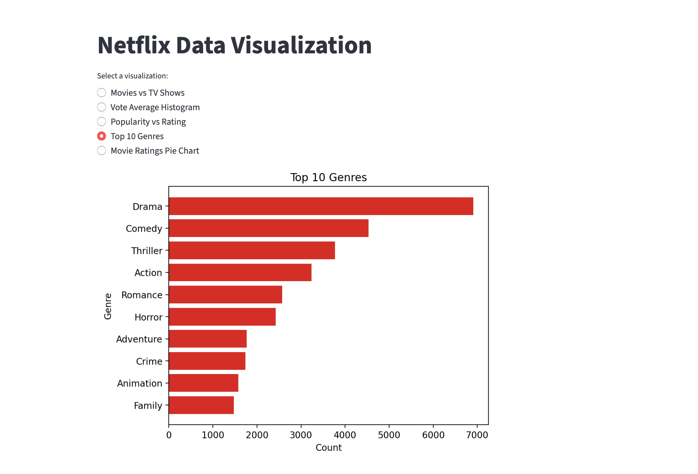

# Netflix Data Portfolio — DSCI 351

End-to-end analysis of the Netflix catalog across four data-engineering stacks: a **MySQL** relational schema with indexed-query optimization, the same questions re-implemented in **MongoDB** aggregation pipelines and **PySpark**, a Spark performance-optimization experiment, and a **Streamlit** dashboard.

Coursework from USC's DSCI 351 (Fall 2025). Course group project with Nazif Masud and Deena Siddharth Bandi — see `analysis/case_study.md` for the full writeup.

## Stack

- **MySQL** — normalized 8-table schema (`Person`, `Genre`, `Director`, `Cast_Member`, `NetflixShow`, `ShowGenre`, `ShowDirector`, `ShowCast`) with a Python loader, four business questions solved in SQL, pandas, and SQL-with-index, and side-by-side `EXPLAIN` plans (`sql/`).
- **MongoDB** — the same Q1–Q8 catalog questions re-implemented as aggregation pipelines, including a `$lookup` join (`mongodb/queries.js`).
- **PySpark** — Q1–Q8 in DataFrame API, plus deeper analytics (genre breadth over time, catalog depth per genre, rating vs. breadth, added-year lag) and a five-step query-optimization experiment on the lag summary — baseline / `.explain(True)` / cache / column pruning / repartitioning (`analysis/351_project_spark.ipynb`).
- **Streamlit** — 5-visualization interactive dashboard over the TMDB movie feature set (`app/streamlit_netflix.py`).

## Repo layout

```
data/       raw CSVs (TMDB movies + Netflix titles + tv_shows)
sql/        data cleaning + MySQL schema build + indexed query benchmarks
mongodb/    MongoDB aggregation pipelines for Part 2.1 Q1-Q8
analysis/   PySpark project notebook + case-study writeup
app/        Streamlit dashboard
```

## How to run

### Streamlit dashboard
```bash
pip install -r requirements.txt
streamlit run app/streamlit_netflix.py
```
Then open the local URL Streamlit prints (default `http://localhost:8501`).

### PySpark notebook
Open `analysis/351_project_spark.ipynb` in Google Colab (recommended) or JupyterLab. Upload `data/_netflix_titles.csv` and `data/movies.csv` when prompted; the notebook installs PySpark on the first cell.

### MongoDB queries
Import the raw CSVs into a `netflix` database (one collection per file):
```bash
mongoimport --db netflix --collection movies         --type csv --headerline --file data/movies.csv
mongoimport --db netflix --collection netflix_titles --type csv --headerline --file data/_netflix_titles.csv
```
Then paste queries from `mongodb/queries.js` into `mongosh` or MongoDB Compass.

### SQL pipeline
Set the DB connection details via environment variables (nothing is committed):
```bash
export NETFLIX_DB_USER=your_user
export NETFLIX_DB_PASSWORD=your_password
export NETFLIX_DB_HOST=your_host
export NETFLIX_DB_NAME=your_db
python sql/main.py     # data_cleaning → schema build → data load
python sql/python_sql_query.py   # run the four business-question queries with EXPLAIN
```

## Data

- `data/_netflix_titles.csv` — Netflix catalog (title, type, director, cast, country, rating, listed_in, description)
- `data/movies.csv` — 16,001-row TMDB movie feature file (`popularity`, `vote_average`, `vote_count`, `genres`, `budget`, `revenue`, etc.) used by the Streamlit dashboard
- `data/tv_shows.csv` — TMDB TV catalog, joined with `movies.csv` in the data-cleaning step

Data © [The Movie Database (TMDB)](https://www.themoviedb.org/). This project uses the TMDB API but is not endorsed or certified by TMDB.

## Screenshot


